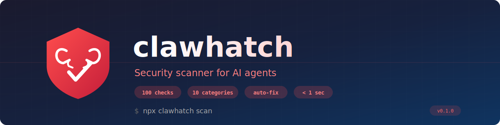

<p align="center">
  
</p>

<p align="center">
  <a href="https://www.npmjs.com/package/clawhatch"></a>&nbsp;
  <a href="https://opensource.org/licenses/MIT"></a>&nbsp;
  <a href="https://nodejs.org/"></a>&nbsp;
  <a href="https://www.npmjs.com/package/clawhatch"></a>
</p>

<br>

<h3 align="center">🔴 Your AI agent has shell access, file control, and browser automation.<br>Is anyone checking its security?</h3>

<p align="center">
  <strong>Clawhatch</strong> runs <strong>100 automated security checks</strong> on your <a href="https://openclaw.com">OpenClaw</a> AI agent config.<br>
  Scores 0–100 · Auto-fixes safe issues · Runs in under a second · 100% offline
</p>

<br>

<p align="center">
  <code>npx clawhatch scan</code>
</p>

<p align="center"><em>No install. No account. No data leaves your machine. One command.</em></p>

<br>

---

<br>

## ⚡ Before & After

<table>
<tr>
<td width="50%">

### 😰 Before Clawhatch
```
Score: 24/100 (F — Critical)

🔴 3 API keys in plaintext config
🔴 Gateway bound to 0.0.0.0
🔴 Auth token: 16 characters
🟡 No .gitignore for secrets
🟡 PII detected in session logs
🟡 Shell access unrestricted
🔵 No retention policy
🔵 No monitoring
```
**You don't know what you don't know.**

</td>
<td width="50%">

### 🛡️ After `--fix`
```
Score: 93/100 (A+ — Excellent)

✅ Keys moved to .env
✅ Gateway bound to 127.0.0.1
✅ 64-char random auth token
✅ .gitignore updated
✅ Log scrubbing enabled
✅ Tool allowlist configured
✅ 30-day retention set
✅ Monitoring enabled
```
**93 points in 3 seconds.**

</td>
</tr>
</table>

<br>

---

<br>

## 🚀 Quick Start

```bash
# One command. That's it.
npx clawhatch scan
```

```bash
# Want the full picture? Scan workspace files too.
npx clawhatch scan --workspace .
```

```bash
# Auto-fix everything it can (backs up config first)
npx clawhatch scan --fix
```

<br>

---

<br>

## 🔍 What It Scans

<table>
<tr>
<td align="center" width="20%">

🔐
#### Identity & Access
**15 checks**
DM policies, allowlists, pairing, access groups, OAuth

</td>
<td align="center" width="20%">

🌐
#### Network
**10 checks**
Gateway binding, auth mode, TLS, CORS, port exposure

</td>
<td align="center" width="20%">

📦
#### Sandbox
**8 checks**
Exec policies, workspace access, Docker isolation

</td>
<td align="center" width="20%">

🔑
#### Secrets
**30 checks**
API keys in config/logs, .env perms, key rotation

</td>
<td align="center" width="20%">

🛠️
#### Tools
**20 checks**
Shell access, Docker socket, dangerous combos, timeouts

</td>
</tr>
<tr>
<td align="center">

🧩
#### Skills
**12 checks**
Untrusted sources, eval(), native modules, sandboxing

</td>
<td align="center">

🤖
#### Model
**7 checks**
Legacy models, injection risk, SOUL.md exposure

</td>
<td align="center">

☁️
#### Cloud Sync
**1 check**
iCloud, OneDrive, Dropbox, Google Drive detection

</td>
<td align="center">

💾
#### Data
**10 checks**
PII in logs, retention, encryption at rest, backups

</td>
<td align="center">

⚙️
#### Operational
**7 checks**
Logging, monitoring, health checks, git secrets

</td>
</tr>
</table>

<br>

---

<br>

## 📊 Example Output

```
  Clawhatch Security Scanner v0.1.0

  ══════════════════════════════════════════════════
  ██  Security Score: 40/100 (D — Poor)         ██
  ══════════════════════════════════════════════════

  Platform: win32
  Checks: 100 run, 89 passed, 11 findings
  Duration: 276ms · Scanned: 27 files

  ──────────────────────────────────────────────────

  🔴 CRITICAL (1)

  !! API key(s) found in openclaw.json
     2 hardcoded API key(s) — move all to .env
     Risk: Keys exposed if config is shared or committed
     Fix: Move to .env, use ${VAR_NAME} substitution

  🟡 HIGH (2)

  ! OAuth token in session log
     Bearer token values detected in session logs
     Fix: Enable session log scrubbing

  ! Session log may contain PII
     Patterns resembling personal data (email, phone)
     Fix: Enable PII scrubbing or reduce log verbosity

  🔵 MEDIUM (4)

  ~ Credentials in error messages
  ~ No tool allowlist configured
  ~ Shell commands may contain secrets
  ~ No data retention policy

  ⚪ LOW (4)

  - Large session log (15.0MB) — sampled
  - Reasoning enabled in group contexts
  - Verbose mode enabled in group contexts
  - No log rotation configured

  ──────────────────────────────────────────────────

  ⚡ 3 issue(s) can be auto-fixed → run with --fix
```

<br>

---

<br>

## 🏆 Scoring System

<table>
<tr>
<td align="center"><h1>A+</h1>90–100<br><strong>Excellent</strong></td>
<td align="center"><h1>A</h1>80–89<br><strong>Good</strong></td>
<td align="center"><h1>B</h1>70–79<br><strong>Acceptable</strong></td>
<td align="center"><h1>C</h1>50–69<br><strong>Needs Work</strong></td>
<td align="center"><h1>D</h1>30–49<br><strong>Poor</strong></td>
<td align="center"><h1>F</h1>0–29<br><strong>Critical</strong></td>
</tr>
</table>

| Severity | Penalty |
|----------|---------|
| 🔴 Critical | **−15 points** (hard-caps score at 40) |
| 🟡 High | −8 points |
| 🔵 Medium | −3 points |
| ⚪ Low | −1 point |

> **⚠️ Critical cap:** Any critical finding locks your score at **40 max**. Fix critical issues first.

<br>

---

<br>

## 🔧 Auto-Fix (`--fix`)

```bash
npx clawhatch scan --fix
```

| Fix Type | Action | Example |
|----------|--------|---------|
| ✅ **Safe** (automatic) | Applied instantly | Move API keys to .env, add .gitignore entries, generate strong tokens |
| ⚠️ **Behavioral** (prompts) | Asks before changing | Change DM policy to allowlist, enable sandbox, rebind gateway |

**Every fix creates a timestamped backup** (`.bak.<timestamp>`) before touching your config. Zero risk.

<br>

---

<br>

## 📋 All Commands

```bash
clawhatch scan                        # Basic scan
clawhatch scan --workspace .          # Include workspace files (SOUL.md, skills)
clawhatch scan --deep                 # Full session log analysis
clawhatch scan --fix                  # Auto-fix safe issues
clawhatch scan --json                 # JSON output for CI/CD
clawhatch scan --format html          # HTML report
clawhatch scan --path /custom/path    # Custom OpenClaw path
clawhatch scan --share                # Share anonymized results with community

clawhatch init                        # Generate hardened baseline config
clawhatch threats                     # View community threat feed
clawhatch subscribe --webhook URL     # Alert on new threats
```

<br>

---

<br>

## 🤖 CI/CD Integration

### GitHub Actions

```yaml
name: Security Audit
on: [push, pull_request]

jobs:
  clawhatch:
    runs-on: ubuntu-latest
    steps:
      - uses: actions/checkout@v4
      - uses: actions/setup-node@v4
        with:
          node-version: '18'

      - name: Run Clawhatch scan
        run: npx clawhatch scan --workspace . --json > clawhatch-report.json

      - name: Check score
        run: |
          score=$(jq '.score' clawhatch-report.json)
          echo "Security score: $score"
          [ "$score" -ge 50 ] || exit 1

      - uses: actions/upload-artifact@v4
        if: always()
        with:
          name: clawhatch-report
          path: clawhatch-report.json
```

<br>

---

<br>

## 📡 Community Threat Intelligence

Share anonymized results. Get collective immunity.

```bash
clawhatch scan --share          # Upload anonymized findings
clawhatch threats               # View trending threats
clawhatch subscribe --webhook https://discord.com/api/webhooks/...
```

**What gets shared:** Check IDs + severity only. **What never leaves your machine:** File paths, secrets, descriptions, config values.

> If 45% of users suddenly have NETWORK-001, that's flagged as trending. Subscribers with that vulnerability get an instant webhook alert.

<br>

---

<br>

## 📦 JSON Export

```bash
clawhatch scan --json > report.json
```

```json
{
  "score": 82,
  "summary": {
    "grade": "A",
    "critical": 0,
    "high": 1,
    "medium": 2,
    "low": 0,
    "autoFixable": 1
  },
  "findings": [ ... ],
  "checksRun": 100,
  "duration": 276,
  "platform": "win32"
}
```

| Exit Code | Meaning |
|-----------|---------|
| `0` | Scan passed (no critical findings) |
| `1` | Critical findings detected |

<br>

---

<br>

## 💻 Platform Support

| Platform | Status |
|----------|--------|
| **Windows** | ✅ Full support |
| **Linux** | ✅ Core checks (platform-specific expanding) |
| **macOS** | ✅ Core checks (platform-specific expanding) |

<br>

---

<br>

## 🎨 Brand

| | Color | Hex |
|--|-------|-----|
| 🔴 | Clawhatch Red | `#C41E3A` |
| ⬛ | Deep Navy | `#1A1A2E` |
| 🟥 | Alert Red | `#FF4D4D` |
| 🩷 | Scan Pink | `#FF8080` |

Logo and banner: [`assets/`](assets/)

<br>

---

<br>

## 🤝 Contributing

1. Fork the repo
2. Create a feature branch (`git checkout -b feat/my-check`)
3. Add checks following the pattern in `src/checks/`
4. Run tests: `npm test` (301 passing)
5. Submit a PR

<br>

## 📄 License

[MIT](LICENSE) © Clawhatch

<br>

---

<p align="center">
  <strong>Built by a solo developer in Cardiff 🏴󠁧󠁢󠁷󠁬󠁳󠁿 who found 3 API keys in his own config.</strong><br>
  <em>If it happened to me, it's happening to you.</em>
</p>

<p align="center">
  <code>npx clawhatch scan</code>
</p>
